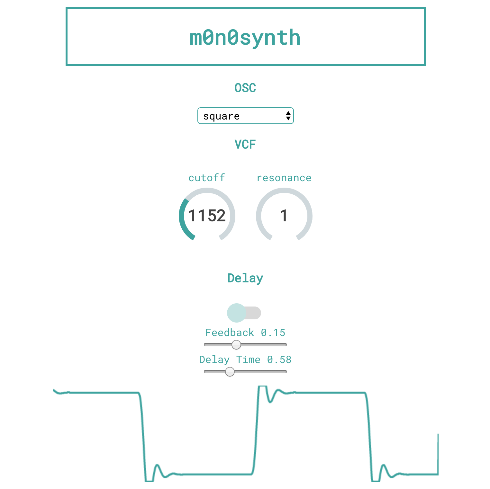

# m0n0synth

[http://www.m0n0synth.com](http://www.m0n0synth.com)

Single oscillator subtractive synthesizer built on the [web audio api](https://developer.mozilla.org/en-US/docs/Web/API/Web_Audio_API) & [tone.js](https://tonejs.github.io/) as a project for Fullstack Academy's 4-day hackathon during the 2018 autumn cohort. Open to pull requests.

## How to play

Your keyboard simulates a piano. Rendering parameter changes requires initializing a new note.

A = C3 // K = C4

## OSC

oscillator waveform selection

- square
- sawtooth
- sine
- triangle

## VCF

lowpass filter w/ -24 db rolloff

- cutoff range : 0 - 3500 Hz
- resonance Q control : 0 - 15

## Delay

feedback delay built from tone.js

- toggle: on / off
- delay time : 0 - 2 seconds
- output feedback level : 0 - 0.4

## Oscilloscope

- dynamically renders the waveform using the Web Audio API analyser node

## Notes

Built on a fork from [react-webaudio-examples](https://github.com/oftenfrequent/react-webaudio-examples)

This project was bootstrapped with [Create React App](https://github.com/facebookincubator/create-react-app)

## UI

